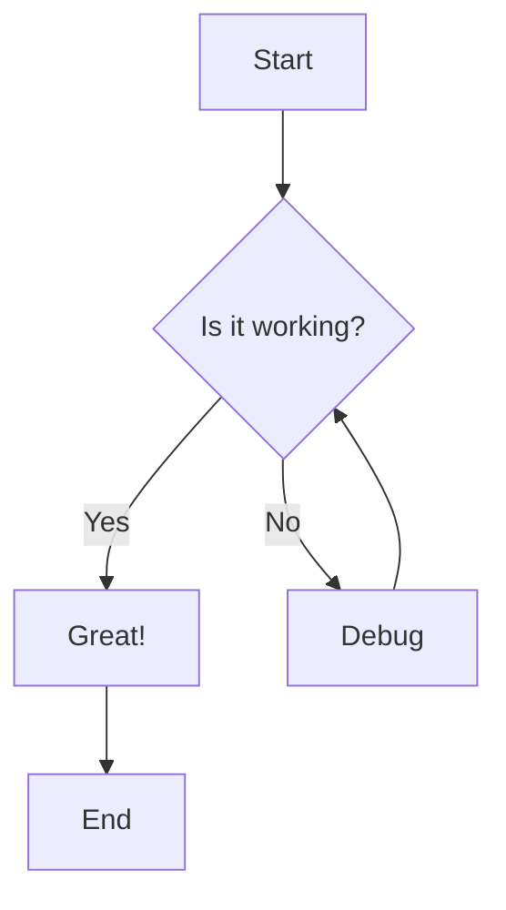
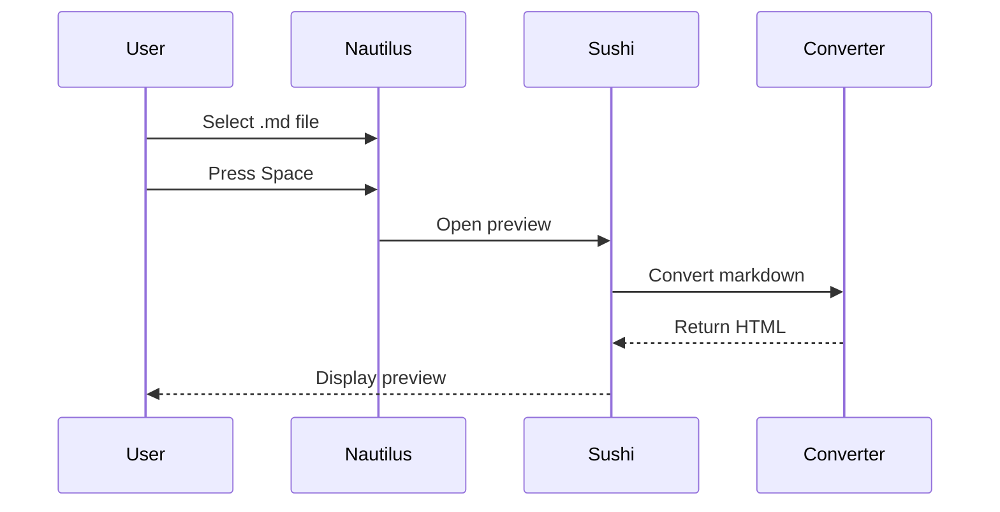

# Comprehensive Markdown Flavor Test

This document tests various markdown flavors and formatting features supported by the GNOME Markdown Quick Look extension.

## Standard Markdown Features

### Text Formatting

**Bold text** and *italic text* and ***bold italic***.

~~Strikethrough text~~ (GFM feature).

==Highlighted text== (some flavors).

H~2~O and X^2^ (subscript/superscript in some flavors).

### Links and References

[Basic link](https://example.com)

[Link with title](https://example.com "Example Site")

<https://example.com> (automatic link)

Reference-style link: [GitHub][github-link]

[github-link]: https://github.com

### Lists

#### Unordered Lists
- Item 1
- Item 2
  - Nested item 2.1
  - Nested item 2.2
    - Deep nested item
- Item 3

#### Ordered Lists
1. First item
2. Second item
   1. Nested numbered item
   2. Another nested item
3. Third item

#### Task Lists (GFM)
- [x] Completed task
- [ ] Incomplete task
- [x] Another completed task
  - [x] Nested completed task
  - [ ] Nested incomplete task

### Code

Inline `code` with backticks.

```javascript
// Fenced code block with syntax highlighting
function fibonacci(n) {
    if (n <= 1) return n;
    return fibonacci(n - 1) + fibonacci(n - 2);
}

console.log(fibonacci(10)); // 55
```

```python
# Python code example
def quicksort(arr):
    if len(arr) <= 1:
        return arr
    pivot = arr[len(arr) // 2]
    left = [x for x in arr if x < pivot]
    middle = [x for x in arr if x == pivot]
    right = [x for x in arr if x > pivot]
    return quicksort(left) + middle + quicksort(right)

print(quicksort([3, 6, 8, 10, 1, 2, 1]))
```

```bash
# Shell script example
#!/bin/bash
echo "Hello, World!"
for i in {1..5}; do
    echo "Count: $i"
done
```

### Tables (GFM)

| Feature | Standard | GFM | CommonMark | Pandoc | Extra |
|---------|----------|-----|------------|--------|-------|
| Headers | ✅ | ✅ | ✅ | ✅ | ✅ |
| Lists | ✅ | ✅ | ✅ | ✅ | ✅ |
| Code | ✅ | ✅ | ✅ | ✅ | ✅ |
| Tables | ❌ | ✅ | ❌ | ✅ | ✅ |
| Task Lists | ❌ | ✅ | ❌ | ✅ | ❌ |
| Strikethrough | ❌ | ✅ | ❌ | ✅ | ❌ |

| Left Aligned | Center Aligned | Right Aligned |
|:-------------|:--------------:|--------------:|
| Left | Center | Right |
| Data | Data | Data |

### Blockquotes

> This is a blockquote.
> 
> It can contain multiple paragraphs.
> 
> > Nested blockquotes are also possible.
> 
> ### Headers work too
> 
> - And lists
> - Inside blockquotes

### Horizontal Rules

---

***

___

## GitHub Flavored Markdown (GFM) Features

### Username Mentions
@octocat mentioned this issue.

### Issue References
This relates to issue #123 and pull request #456.

### Emoji (if supported)
:smile: :heart: :thumbsup: :rocket: :octocat:

### Automatic URL Detection
Visit https://github.com for more information.

## Mathematical Expressions (with MathJax)

Inline math: $E = mc^2$

Block math:
$$
\sum_{i=1}^{n} i = \frac{n(n+1)}{2}
$$

More complex equation:
$$
\int_{-\infty}^{\infty} e^{-x^2} dx = \sqrt{\pi}
$$

Matrix:
$$
\begin{pmatrix}
a & b \\
c & d
\end{pmatrix}
$$

## Definition Lists (Extra/Pandoc)

Term 1
:   Definition 1

Term 2
:   Definition 2a
:   Definition 2b

## Footnotes

Here's a sentence with a footnote[^1].

Another footnote reference[^note].

[^1]: This is the first footnote.

[^note]: This is another footnote with a longer description.
    It can have multiple paragraphs and code:
    
    ```
    Code in footnotes
    ```

## Abbreviations (Extra)

*[HTML]: Hypertext Markup Language
*[CSS]: Cascading Style Sheets

The HTML and CSS specifications are maintained by W3C.

## Keyboard Keys (PyMdown)

Press ++ctrl+alt+del++ to restart.

To save: ++ctrl+s++

## Admonitions/Callouts (GitLab style)

> **Note**
> This is a note callout.

> **Warning** 
> This is a warning callout.

> **Tip**
> This is a tip callout.

## Mermaid Diagrams (if supported)





## HTML in Markdown (if allowed)

<details>
<summary>Click to expand</summary>

This is hidden content that can be revealed.

</details>

<mark>Highlighted text using HTML</mark>

<kbd>Ctrl</kbd> + <kbd>C</kbd>

## Special Characters and Escaping

\*Not italic\* and \**not bold**

\# Not a header

Copyright © 2024

Trademark™ and Registered®

Em dash — and en dash –

Ellipsis…

"Smart quotes" and 'smart quotes'

## Line Breaks

This line ends with two spaces  
So this line starts on a new line.

This line doesn't  
So this continues on the same line.

---

## Flavor Comparison Summary

This document demonstrates features across different markdown flavors:

- **Standard**: Basic markdown features
- **CommonMark**: Strict specification compliance  
- **GFM**: GitHub extensions (tables, task lists, strikethrough)
- **Extra**: PHP Markdown Extra (definition lists, footnotes, abbreviations)
- **Pandoc**: Extensive extensions and format support
- **GitLab**: GFM + GitLab-specific features
- **PyMdown**: Enhanced GitHub-like experience with additional extensions

Choose the flavor that best matches your source content and desired features!